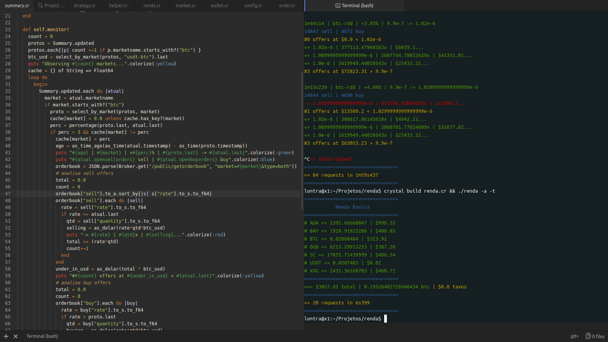
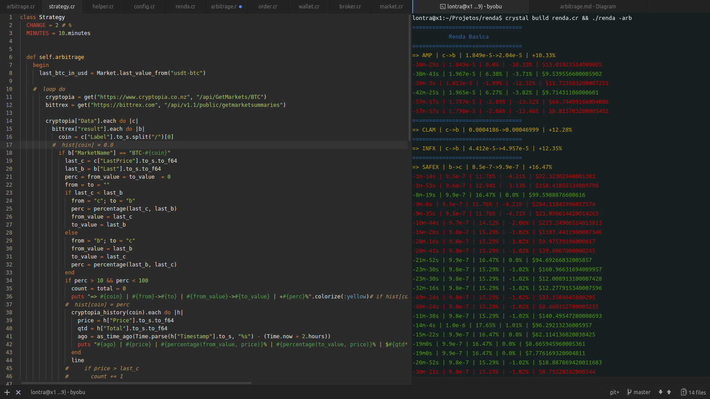
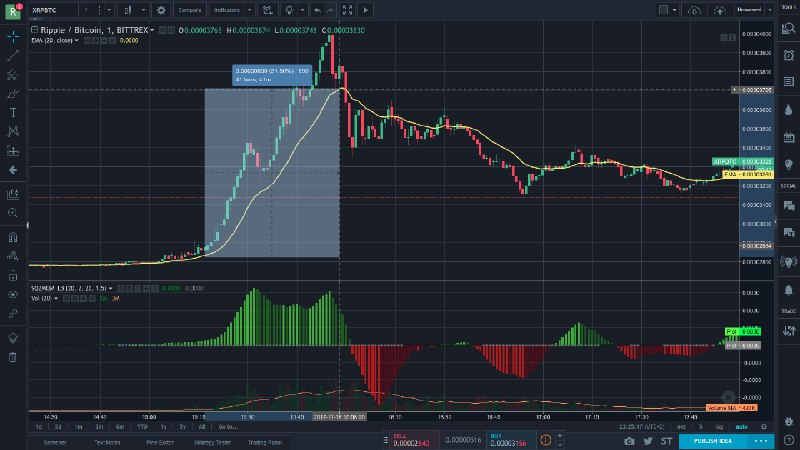

### Renda
---
This software is written in [Crystal](https://crystal-lang.org/) programming language by [ExtraPolo!](http://extrapolo.com/), allowing it to be compiled as a binary, running *much faster* than tradition script languages like Python or Java. Detect price variation and make order could happen in 0.2 miliseconds.

It basically conceptualizes and operates Wallets, Market Summaries, Coin Ticks, Orders, Markets, Brokers, Arbitrage and Strategies, mostly on Bittrex but also Cryptopia.

Methods,

- list wallets coins values in dolar
- list spent taxes on orders
- show history
- pump detectors (ex: which coin values grows 5% in 5 minutes)
- fake order/buy to simulate price evolution
- detect arbitrage opportunities (price different in betwwen brokers)
- make order in dolar (ex: buy $50 of XRP)
- log all activities


```
Usage: renda [arguments]
    -l, --log                        Show broker HTTP/JSON request/answer logs
    -s, --simulate                   Fake buy
    -a, --assets                     Show wallets
    -t, --total                      Sum wallets values and taxes in dolar
    -o, --orders                     Show previous orders
    -obs, --observe                  Observe markets
    -arb, --arbitrage                Arbitrage
    -m MARKET, --market=NAME         Set market to buy
    -v VALUE, --value=VALUE          Set value to buy in dolars
    -b, --buy                        Buy {market} and {value} from BTC
    -h, --help                       Show this help
```

It was developed in between Athens and Lisbon over October-2017 - February-2018 to answer personal curiosities about the cryptomarkets, in the dream of a golden algorithm to provide a basic income.

---

### Samples

-- show wallet


-- Detecting 2% price variation in 10 minutes, showing buy/sell book.




-- Visual proof, using other online tool.

---

Research & Development become inactive, despite promising strategies and enhancing patterns detection, in order of real-world job-based income.
